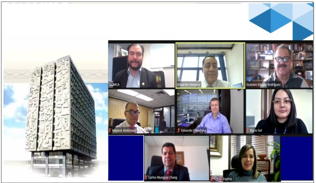

```{r setup, include=FALSE}
knitr::opts_chunk$set(echo = FALSE)
```
## ÚLTIMAS NOTICIAS

- Cuarta Reunión del Grupo ad-hoc de Oficiales de Cumplimiento de los Bancos Centrales de la Región. [Boletín de prensa](https://www.secmca.org/wp-content/uploads/2022/02/Reuni%C3%B3n-Virtual-del-Grupo-ad-hoc-de-Oficiales-de-Cumplimiento-de-los-Bancos-Centrales-de-la-Regi%C3%B3n..pdf)

- Grupo ad-hoc de Oficiales de Cumplimiento de los Bancos Centrales de la Región organizan primera capacitación interna. [Boletín de prensa](http://www.secmca.org/wp-content/uploads/2021/06/Boletin-de-Prensa-Capacitaci%C3%B3n-Interna-GOC.pdf)


```{r echo=FALSE, out.width = "500px", out.height="250px",fig.align='center'}

```


- Tercera Reunión del Grupo ad-hoc de Oficiales de Cumplimiento de los Bancos Centrales de la Región. [Boletín de prensa](http://www.secmca.org/wp-content/uploads/2021/03/Boletin-de-Prensa-Reuni%C3%B3n-Virtual-GOC.pdf)


